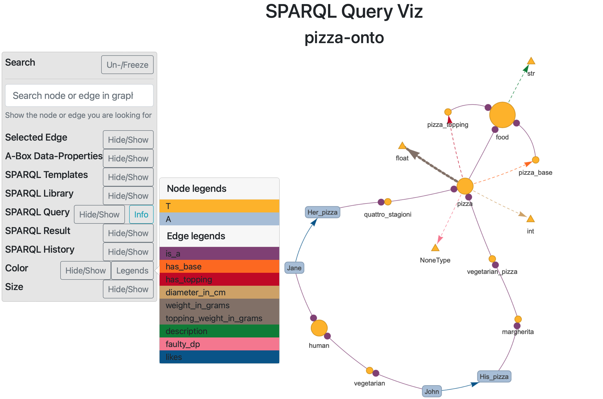

*Your interactive ontology visualizing and SPARQL query formulation tool*

[[_TOC_]]

## What is *SPARQL Query Viz*

*SPARQL Query Viz* is a python based interactive ontology visualizing tool, that supports you to compose SPARQL queries interactively. 

The straightforward visualization can be adjusted to your needs by coloring and sizing of the graph elements. You can also turn of the visualization of *ABoxes* if the visualized ontology is cluttering the display. 

*SPARQL Query Viz* provides an interactive query formulation and composition panel, that enables you to write queries, by making use of templates and other useful features. You can evaluate the queries and see the visualized result in the context of the ontology.

## Requirements

*SPARQL Query Viz* requires the following python packages, 
1. Dash
    - dash_core_components
    - dash_html_components 
2. dash_bootstrap_components
3. visdcc
4. ontor
5. owlready2

## Installation

1. Clone the repo from [GitLab](https://gitlab.lrz.de/maximilianmayerhofer/SPARQL-Query-Viz)
2. Set up a virtual enivornment, by using `python -m venv myenv` and activate the env:
    - (Windows) `.\\myvenv\\Scripts\\activate.bat`
    - (Linux & MacOS) `source myvenv/bin/activate`

## Getting started

To visualize the included *Pizza-ontology*, the file `SPARQLQueryViz_run_pizza_example.py` has to be excecuted.
Alternativly the following two lines of code also do the job:

```python
from jaal import Jaal
jl = Jaal(iri = "http://example.org/onto-ex.owl", path = "./jaal/datasets/ontologies/pizza", abox = True)
jl.plot(host = "127.0.0.1", port = 8050, directed = True, vis_opts = "small")
```

1. The main visualization class `Jaal` is imported. 
2. `Jaal` is initialised by passing the following optional arguments to the constructor:
    - `iri`: The *Internationalized Resource Identifier* of the ontology
    - `path`: The path to the ontology file
    - `abox`: The option to turn on or off the visualization of the *ABoxes* in the ontology
3. The `plot` method of `Jaal` is called with the following optional arguments_
    - `host`: The host of the `Dash`-app
    - `port`: The port of the `Dash`-app
    - `directed`: The option to visualize the edges with arrowheads
    - `vis_opts`: The option to pass additional visualization options to the `visdcc`-graph

Note, that all of the arguments are optional. The default values for these aruments are the same as passed to the functions in the example above. Except for the argument `vis_opts` in the `plot` method: The default value here is `vis_opts = None `. Passing the keyword `"small"` adjusts the visualization options for small ontologies.

After running the plot, the console will prompt the default localhost address (`127.0.0.1:8050`) where Jaal is running. Access it to see the following dashboard:



## Features

Currently, the dashboard consist of following components:
1. **GUI panel:** here the ontology data can be explored, it further contain following sections:
    - **Search:** can be used to find a node in graph
    - **Selected Edge:** shows the meaning of an edge that is selected
    - **A-Box Data-Properties:** shows the instantiated data properties of an instance that is selected (This section is invisble when no *ABoxes* are visualized)
    - **SPARQL Templates:** provides templates for common SPARQL queries
    - **SPARQL Library:** provides inconsistency checking queries for the use-case ontology
    - **SPARQL Query:** provides options to interactively compose SPARQL queries and shows the currently formulated query
    - **SPARQL Result:** shows the result of evaluated queries and provides a silder to adjust the context of the result visualization
    - **SPARQL History:** shows an adjustable number of sucessfully evaluated queries
    - **Color:** provides options to color node and edges (is activated per default) and optionally shows the color legend
    - **Size:** provides options to size node and edges (is activated per default)

2. **Graph:** the ontotlogy visualization or the query result visualization (if query was evaluated)

## Extra settings

### Turn off *ABox* visualization

By default the *ABoxes* of an ontology are displayed in the graph. To disable the *ABox* visualization, `abox = False` has to be passed to the `Jaal` constructor:

```python
# turn of abox visu
jl = Jaal(iri = "http://example.org/onto-ex.owl", path = "./jaal/datasets/ontologies/pizza", abox = False)
```

### Plot undirected graph

By default, `Jaal` plots directed edges for the ontology visualization. This setting can be changed by,

```python
Jaal().plot(directed = False)
```

### Tweak visualization options

The visualization options of the `vis.js` related visualization settings, can be tweaked to the your needs. 

The default is `vis_opts = None`. Thereby *SPARQL-Query-Viz* takes the predefined settings for visualising large ontologies.

For small ontologies it is usefull to use the predefined visualization options for small ontologies, by passing `vis_opts = "small"`:

```python
Jaal().plot(vis_opts="small")
```
To adjust the visualization settings further, additional options can be passed like shown in the example below:

```python
Jaal(edge_df, node_df).plot(vis_opts={'height': '600px', # change height
                                      'interaction':{'hover': False}, # turn off the hover 
                                      'physics':{'stabilization':{'iterations': 100}}}) # define the convergence iteration of network

```

For a complete list of settings, visit [vis.js website](https://visjs.github.io/vis-network/docs/network/).

### Adjust Port

If you are facing port related issues, try the following way to run *SPARQL-Query-Viz*:

```python
port=8050
while True:
    try:
        Jaal().plot(port=port)
    except:
        port+=1
```

## 👉 Issue tracker

Please report any bug or feature idea using Jaal issue tracker: https://github.com/imohitmayank/jaal/issues

## 👉 Collaboration

Any type of collaboration is appreciated. It could be  testing, development, documentation and other tasks that is useful to the project. Feel free to connect with me regarding this.

## Contact

You can connect with me on [LinkedIn](www.linkedin.com/in/maximilian-mayerhofer-41804917b)

## License

*SPARQL-Query-Viz* is licensed under the terms of the MIT License (see the file
LICENSE).
